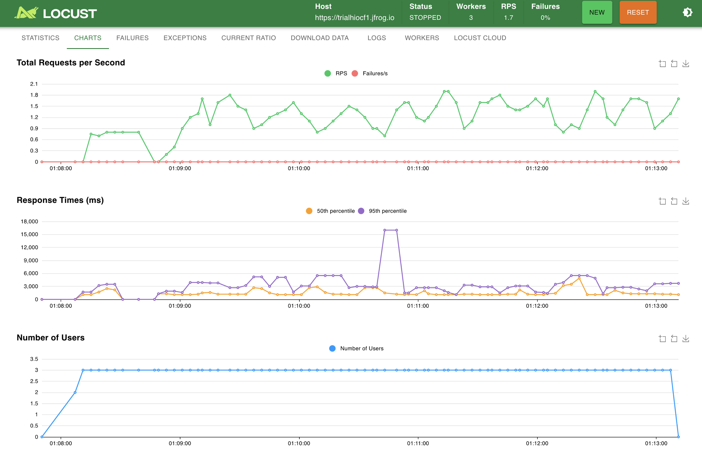
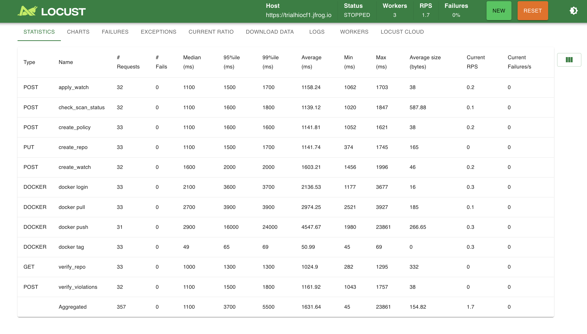

# 🧪 JFrog Xray Load Test with Locust

This repository contains a distributed load testing setup using Locust to test JFrog Xray's Docker image scan performance.

## 📁 Project Structure
├── **locustfile.py** # Main Locust test file

├── **docker.py** # Run the command line statements

├──**conf.py** # store the configs (e.g. Hostname)

├── **requirements.txt** # Required Python packages

├── **.env** # Your secrets (ignored by Git)

└── **results/** # Output folder for CSV stats (created at runtime)

---

## ⚙️ Prerequisites

- Python 3.9+ (3.11 recommended)
- Docker installed
- Access to a JFrog Artifactory + Xray instance
- Locust installed in a virtual environment

---

## 🔐 Setup Environment Variables

Create a `.env` file in the project root with your credentials:

USERNAME=[your username]

PASSWORD=[your password]

TOKEN = Bearer [your token]

---

## 📦 Install Requirements

Create a virtual environment and install dependencies:

python -m venv .venv

source .venv/bin/activate

pip install -r requirements.txt

---

## 🚀 Running the Load Test in Distributed Mode

**✅ 1. Create Results Directory**

mkdir -p results

**✅ 2. Start the Master Node (in background)**

nohup locust -f locustfile.py --csv=results/output --master > /dev/null 2>&1 < /dev/null &

This starts the master process and writes CSV results to results/output_*.

**✅ 3. Start Worker Nodes (3 workers in this case)**

for i in {1..3}; do
  (nohup locust -f locustfile.py --worker --master-host=(masterhost IP) > /dev/null 2>&1 < /dev/null &)
done

Adjust the number (1..3) based on how many worker processes you want to run.

**✅ 4. Start & Monitor the Test (From UI)**

Open the Locust console in the browser:

http://(masterhost IP):8089/

Provide the number of users, rampup and runtime(optional) & start the test

---

## 🧼 Cleanup
To stop all running Locust processes:

ps aux | grep locust | grep -v grep | awk '{print $2}' | xargs kill -9

---

## 📊 Sample Test Run Output

### 📈 Locust Charts (RPS, Response Time, Users)

---

### 📋 Locust Statistics Table

